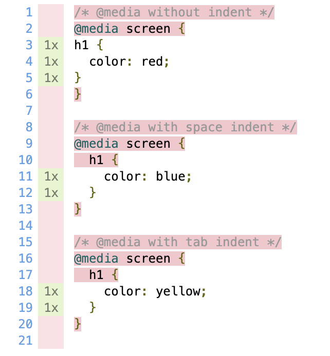

# puppeteer-coverage-bug-in-media-query

https://pirosikick.github.io/puppeteer-coverage-bug-in-media-query/example.css-1.js.html



A css coverage report `puppetter-to-istanbul` generates is broken when `@media` rule has indent.

## Run example

**example.css**<br>
There are 3 `@media` rules in example.css:
1. with no indent
2. with space indent
3. with tab indent
```css
/* @media without indent */
@media screen {
h1 {
  color: red;
}
}

/* @media with space indent */
@media screen {
  h1 {
    color: blue;
  }
}

/* @media with tab indent */
@media screen {
	h1 {
		color: yellow;
	}
}
```

**example.html**
```html
<!DOCTYPE html>
<html lang="en">
  <head>
    <link rel="stylesheet" href="example.css" />
  </head>
  <body>
    <h1>Hello</h1>
  </body>
</html>
```

**collect-coverage.js**<br>
The script which collect css coverage of example.css.
```js
const path = require("path");
const puppeteer = require("puppeteer");
const pti = require("puppeteer-to-istanbul");

(async () => {
  const browser = await puppeteer.launch();
  const page = await browser.newPage();
  await page.coverage.startCSSCoverage();
  await page.goto(`file:///${path.join(__dirname, "example.html")}`);
  const coverage = await page.coverage.stopCSSCoverage();
  pti.write(coverage);

  await browser.close();
})();

```

Please do `npm run collect-coverage` to run collect-coverage.js and generate a coverage report as html.

```console
# Run collect-coverage.js and generate a coverage report 
$ npm run collect-coverage.js
```

After that, `coverage/index.html` will be generated.

```
# Open a coverage report in browser
$ open coverage/index.html
```